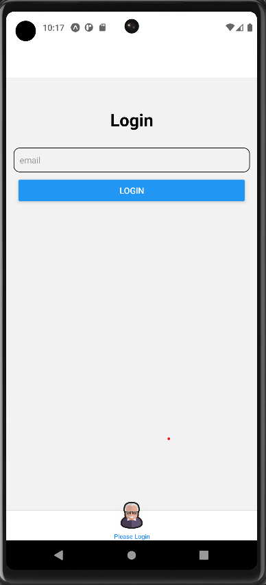
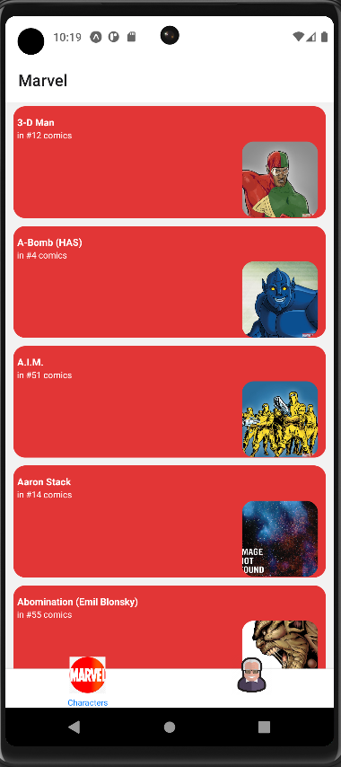
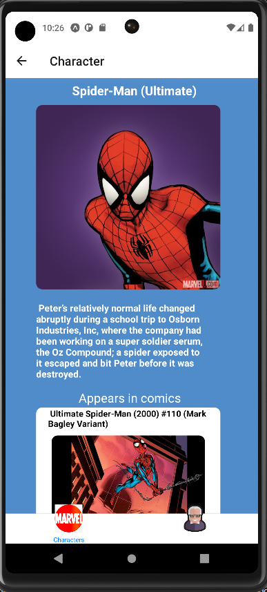
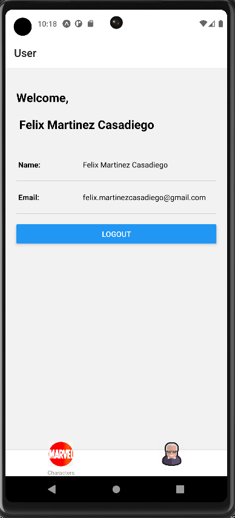

# Marvel App

This repository is about a Marvel app, where you can search for different characters and learn a little about them.

## Description

I used for the creation React Native, Typescript, Formik, Yup, Apisauce and the Marvel API `https://developer.marvel.com/`.

You must `yarn start` to start the App; you must login with the authorized email address which is `felix.martinezcasadiego@gmail.com` .

React Native Version: v0.69.6

Node Version: v16.15.0

Yarn Version: 1.22.19

## Screenshots

### Login

### List of characters

### Character Details

### User information

